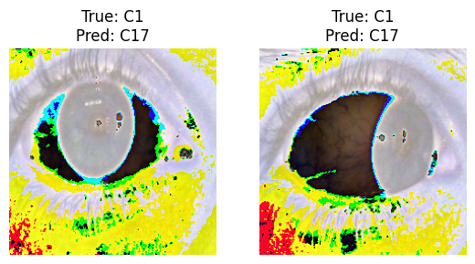

🧿 Iris Texture Feature Extraction using UBIRIS.v2 Dataset

## 📌 Project Description

This project focuses on **unsupervised iris texture feature extraction** using the **UBIRIS.v2** dataset, a challenging iris image dataset collected under unconstrained conditions (e.g., visible light, noise, blur, and reflections). The system applies powerful computer vision techniques to extract visual descriptors from iris regions, including **SIFT keypoints** and **LBP (Local Binary Pattern)** features.

This pipeline is designed as a **preprocessing step** for biometric systems, clustering applications, and further machine learning tasks involving iris data.

---

## 🎯 Objectives

The primary objectives of this project are to:

- ✅ Load and standardize iris images from UBIRIS.v2
- ✅ Detect distinctive and scale-invariant keypoints using SIFT
- ✅ Extract local texture descriptors using LBP
- ✅ Visualize both types of features for analysis and comparison
- ✅ Prepare features for unsupervised learning tasks (e.g., clustering, dimensionality reduction)

---

## 💡 Key Features

- 🔄 **Image Preprocessing**: Resize and convert images to grayscale for consistency.
- 🔍 **SIFT Keypoint Detection**: Detect robust and distinctive iris features invariant to scale and rotation.
- 🧵 **LBP Texture Extraction**: Encode fine-grained local patterns that capture iris texture.
- 🖼️ **Visual Output**: Overlay keypoints and visualize LBP as grayscale patterns.
- 📊 **Extensible Design**: Features can be integrated into unsupervised or supervised pipelines.

---

## ⚙️ Project Overview

The pipeline is divided into the following stages:

### 1. 🔄 Preprocessing
- Load sample image (`ahmed.jpg`) from UBIRIS.v2.
- Resize image to 224×224 pixels.
- Convert to grayscale for analysis.

📍 Input: Raw iris image  
📍 Output: Resized grayscale image for feature extraction

---

### 2. 🔍 SIFT Keypoint Detection
- Apply OpenCV’s `cv2.SIFT_create()` to detect keypoints.
- Overlay keypoints on the original image.

📍 Output: Image with red keypoints

---

### 3. 🧵 LBP Texture Feature Extraction
- Apply `skimage.feature.local_binary_pattern` with (24, 8) settings.
- Visualize as a texture map in grayscale.

📍 Output: LBP feature image

---

## 🖼️ Output Visualization

  

- 🔴 Left: Original iris image with SIFT keypoints
- ⚫ Right: LBP grayscale texture representation

---

## 📊 Applications

This project forms the foundation for various biometric and computer vision tasks:

- 👁️ Iris biometric recognition
- 📈 Feature-based clustering and unsupervised learning
- 🔐 Security and access control
- 🧪 Preprocessing for deep learning pipelines

---

## 📦 Dependencies

Install required libraries:
opencv-python
matplotlib
numpy
scikit-image

## ▶️ How to Run

python iris_features.py

🧬 Dataset
Dataset: UBIRIS.v2
Description: A visible-light iris dataset collected in non-cooperative environments.
Note: Dataset not included in this repo due to license restrictions. Please request access from the official website.

📫 Contact Information

Name: Raiane Yahiaoui
Email: ikba.king2015@gmail.com
LinkedIn: linkedin.com/in/yahiaoui-raiane-253911262

📄 License
This project is provided for academic and research purposes only. Please ensure proper citation of UBIRIS.v2 if you use this dataset.

